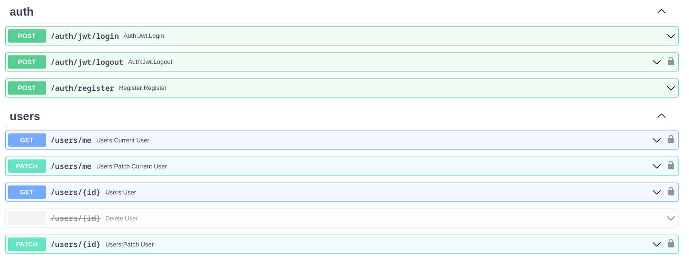
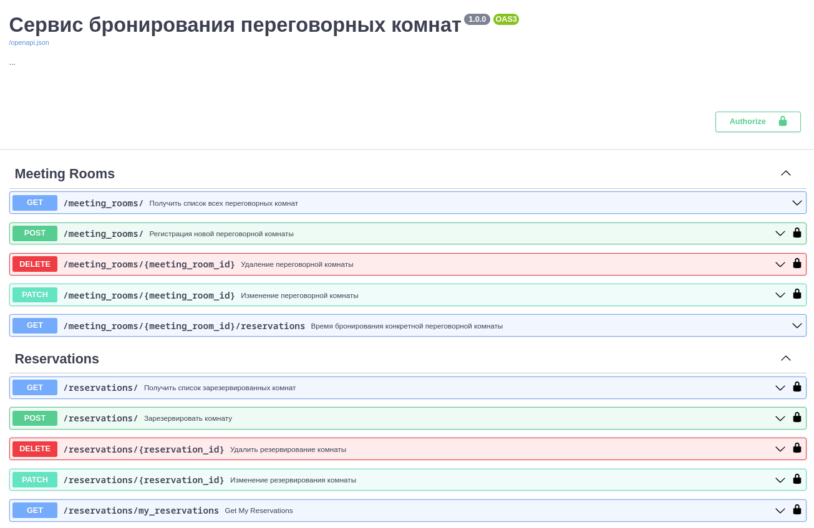

# Сервис на FastApi по бронированию переговорных комнат


## Для чего

Этот проект - асинхронное Api для бронирования переговорных комнат на определённый период времени, чтобы команды сотрудников не конфликтовали между собой, а точно знали, что данная переговорная комната будет свободна для них в это время.

Есть возможность регистрации новых пользователей, которые могут резервировать комнаты.

Создавать новые переговорные комнаты может только Администратор(суперпользователь), который создаётся автоматически при первом запуске проекта (подробности по настройке ниже).

## Используемые технологии

- FastApi = асинхронный веб-фреймворк для создания API
- FastAPI Users = библиотека для регистрации и аутентификации пользователей в FastApi
- SQLAlchemy = ORM для работы с РСУБД
- Alembic = для миграций БД
- Pydantic = валидация данных с использованией тайп-хитингов
- Aiosqlite = асинхронный интерфейс для SQLite
- Uvicorn = ASGI веб-сервер
- Swagger = для документирования Api и его ручек

## Подготовка к запуску

В корневой директории создайте файл `.env` и пропишите там настройки для отображаемого названия приложения и драйвер БД с директорией к файлу БД:

```text
APP_TITLE=Сервис бронирования переговорных комнат
DATABASE_URL=sqlite+aiosqlite:///./fastapi.db
SECRET_KEY=SECRET
FIRST_SUPERUSER_EMAIL=example@email.com
FIRST_SUPERUSER_PASSWORD=1234567890
```

- Пароль для `SECRET_KEY` можно сгенерировать и скопировать в терминале, с помощью команды:

```bash
openssl rand -hex 32
```

> `SECRET_KEY` нужен для генерации токенов для пользователей

- `FIRST_SUPERUSER_EMAIL` и `FIRST_SUPERUSER_PASSWORD` - нужны для создания Администратора, который будет создан автоматически при первом запуске проекта

Создайте виртуальное окружение командой:

```bash
python -m venv venv
```

И выполните установку всех зависимостей проекта:

```bash
pip install -r requirements.txt
```

Когда установка зависимостей завершиться, можно запускать проект, но перед этим необходимо произвести миграции в БД:

```bash
alembic upgrade head
```

## Работа с проектом

Запускаем проект:

```bash
uvicorn app.main:app
```

Переходим по адресу `http://127.0.0.1:8000/docs` - откроется интерфейс Swagger в котором вы сможете ознакомиться с эндпоинтами и типами запросов.

> ReDoc в проекте был отключен. Его можно включить соответствующей настройкой в файле `main.py`



> Запрос на удаление пользователя был отключен, т.к. это может повлечь неразбериху при бронировании комнат из-за каскадного удаления всего, что связано с пользователем. Вместо удаления, под суперпользователем просто отправьте запрос на редактирование пользователя и укажите параметр `is_active` в значение `False`.

Для того, чтобы выполнять запросы где изоображён открытый замок, вам необходимо пройти авторизацию - либо создать нового не суперпользователя, либо авторизоваться под суперпользователем, который был указан в `.env` файле.

Жмите на кнопку `Authorize` в верхнем правом углу и вводите свои данные (только почту и пароль) для авторизации.



Когда авторизация выполнена успешно, иконка замка сменится на закрытый замок и теперь вы можете выполнять нужные запросы. На каждом эндпоинте (ручке) есть описание и примеры запросов, так что дальше разобраться не составит труда.
